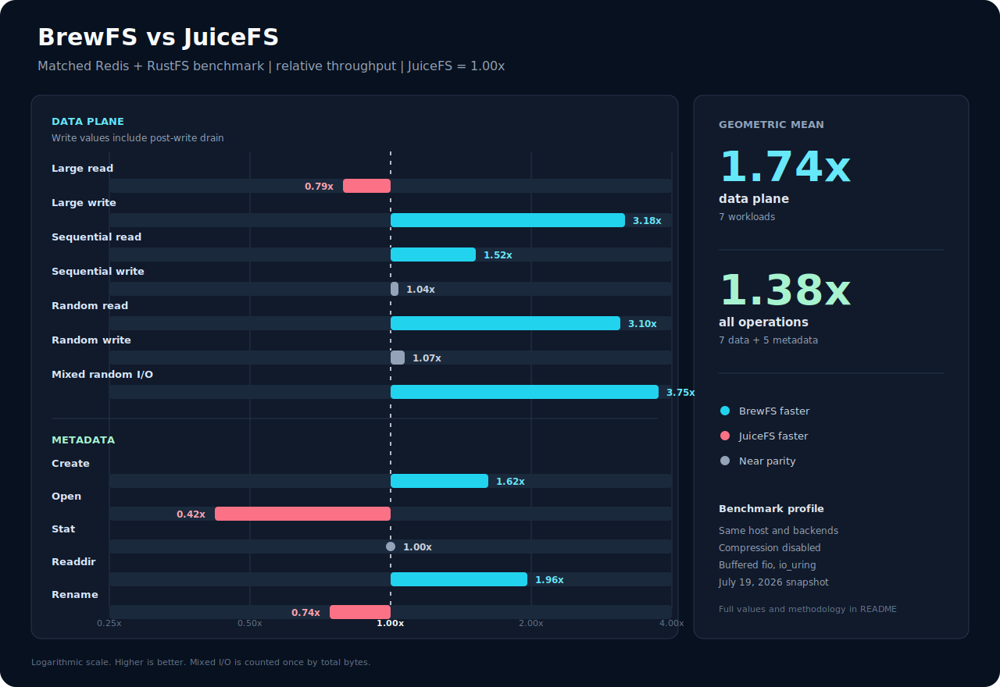

<div align="center">
  
  <p><strong>BrewFS: High-performance distributed storage, built in Rust.</strong></p>

  <p>
    <a href="https://github.com/brewfs/brewfs/actions/workflows/ci.yml"></a>
    <a href="https://github.com/brewfs/brewfs/releases"></a>
    <a href="https://www.rust-lang.org/"></a>
    <a href="LICENSE"></a>
  </p>
  <p>
    <a href="#quick-start">Install</a> ·
    <a href="#performance-vs-juicefs">Benchmarks</a> ·
    <a href="doc/architecture/arch.md">Architecture</a> ·
    <a href="doc/README.md">Documentation</a> ·
    <a href="README_CN.md">中文</a>
  </p>
</div>

BrewFS is an independent distributed filesystem for container, AI, and object-storage-heavy workloads. It combines a POSIX-like FUSE interface with pluggable transactional metadata and S3-compatible data storage.

RustFS is one of the S3-compatible object storage backends supported by BrewFS and is used in the repository's reproducible benchmark and filesystem test profiles.

<p align="center">
  <a href="https://github.com/rustfs/rustfs">
    
  </a>
  <a href="https://github.com/rustfs/rustfs">
    
  </a>
</p>

Against [JuiceFS](https://juicefs.com/) ([GitHub](https://github.com/juicedata/juicefs)), BrewFS delivered a **1.74x data-plane geometric mean** and a **1.38x geometric mean across all 12 reported data and metadata operations** in the matched, fully drained snapshot below. Highlights include **3.18x fully drained large-write throughput**, **3.10x random-read throughput**, **3.75x fully drained mixed-I/O throughput**, and **1.96x readdir throughput**. The complete table also retains the workloads where JuiceFS is faster.



## Why BrewFS

- **Fast data path:** chunked I/O, memory and SSD caches, read-ahead, writeback, and large-write coalescing.
- **Rust throughout:** one modern, memory-safe implementation from FUSE and VFS to metadata and object storage.
- **Storage freedom:** Redis, TiKV, etcd, PostgreSQL, or SQLite metadata with S3-compatible or local object data.
- **Operationally testable:** xfstests, pjdfstest, LTP, stress-ng, fio, metadata benchmarks, fuzzing, and Docker Compose runners live in the repository.

## Performance vs JuiceFS

This local snapshot was collected on the same host with Redis metadata, RustFS S3-compatible storage, compression disabled, and the runners' `--writeback-throughput-profile` on both filesystems. fio used buffered I/O (`direct=0`) with `io_uring`, 4 MiB blocks, and `iodepth=1`; large read/write used eight 128 MiB jobs (1 GiB total). Read tests used prefill-and-drain, a remount, and cleared filesystem caches; write tests included a post-write drain. BrewFS keeps direct-I/O FUSE handles for reads in this profile; that implementation choice is recorded rather than hidden.

### Benchmark Environment (local machine)

- **CPU:** Intel Xeon Platinum (x86_64, 1 socket / 8 vCPU, 2 threads per core)
- **Memory:** 14 GiB available to the benchmark host
- **Kernel:** Linux 6.8.0-117-generic
- **OS:** Ubuntu-based kernel image (GNU/Linux)
- **Storage:** 130 GiB virtual block device

The complete-run artifacts are `perf-run-1784459867-21061` (BrewFS data plane), `perf-run-1784461564-23252` (BrewFS metadata), and `juicefs-perf-run-1784386826-2853` (JuiceFS). The optimized large-read row is the mean of focused reruns `perf-run-1784469566-30242` and `perf-run-1784469601-26934`; the large-write rows use `perf-run-1784473152-32564` and `perf-run-1784473176-9768`. Each artifact contains the raw profile environment, fio JSON or tool logs, diagnostics, warnings, and generated report under `docker/compose-xfstests/artifacts/<run>/`.

The effective profile parameters were:

| System | Effective settings |
| --- | --- |
| BrewFS | `commit_before_upload`; 4 GiB each of memory/SSD read and write cache; 12 GiB memory budget; 6 writeback upload workers; S3 concurrency 16; upload concurrency 32; 1 s / 65,536-entry metadata open cache with write-capable reuse disabled; 16 FUSE workers; `max_background=512`; async-fuse request buffer pool enabled |
| JuiceFS 1.3.1 | `writeback=true`; 8 GiB buffer; 4 GiB local cache; 4 upload workers; 1 s / 65,536-entry open cache; metadata backup disabled; usage reporting disabled. The requested `max-downloads=16` is unsupported by this JuiceFS version and was not passed to the mount. |

For a single-client build or metadata workload that repeatedly opens files with `O_RDWR`, add `--metadata-throughput-profile` to the BrewFS command. It enables `BREWFS_METADATA_ALLOW_WRITE_OPEN_CACHE=true` alongside the 1 s open cache; the latest matching `metaperf` run raised open throughput from 4,989.0 to 5,589.9 ops/s (+12%). This deliberately weakens cross-client close-to-open freshness, so it is not part of the comparison profile above.

### Data throughput

The foreground table reports fio bandwidth while the workload is issuing I/O. It measures application-visible acceptance speed, which can include data still buffered by either filesystem when fio stops.

| Workload | BrewFS | JuiceFS | BrewFS / JuiceFS |
| --- | ---: | ---: | ---: |
| Large write | 912.3 MiB/s | **1.07 GiB/s** | 0.83x |
| Large read | 743.7 MiB/s | **936.9 MiB/s** | 0.79x |
| Sequential read | **1.57 GiB/s** | 1.04 GiB/s | **1.52x** |
| Sequential write | 146.5 MiB/s | **280.6 MiB/s** | 0.52x |
| Random read | **3.75 GiB/s** | 1.21 GiB/s | **3.10x** |
| Random write | 127.9 MiB/s | **312.9 MiB/s** | 0.41x |
| Mixed random read | **237.7 MiB/s** | 119.3 MiB/s | **1.99x** |
| Mixed random write | **108.1 MiB/s** | 55.7 MiB/s | **1.94x** |

For write workloads, the end-to-end comparison uses actual fio bytes divided by `active_io_runtime + post_write_drain`. This includes the time needed to empty each filesystem's writeback queue instead of rewarding a larger unflushed backlog.

| Fully drained workload | BrewFS | JuiceFS | BrewFS / JuiceFS |
| --- | ---: | ---: | ---: |
| Large write | **327.9 MiB/s** | 103.1 MiB/s | **3.18x** |
| Sequential write | **103.4 MiB/s** | 99.7 MiB/s | **1.04x** |
| Random write | **104.4 MiB/s** | 97.8 MiB/s | **1.07x** |
| Mixed random I/O total | **278.0 MiB/s** | 74.2 MiB/s | **3.75x** |

Across large read/write, sequential read/write, random read/write, and mixed random I/O, BrewFS has a **1.74x unweighted geometric mean**. Adding the five metadata operations below gives a **1.38x unweighted geometric mean across all 12 operations**. Mixed I/O is counted once by total bytes in these summaries.

### Metadata throughput

| Operation | BrewFS | JuiceFS | BrewFS / JuiceFS |
| --- | ---: | ---: | ---: |
| Create | **1,054.5 ops/s** | 651.5 ops/s | **1.62x** |
| Open | 5,018.6 ops/s | **12,027.2 ops/s** | 0.42x |
| Stat | **686,751.8 ops/s** | 683,792.0 ops/s | 1.00x |
| Readdir | **34,480.7 ops/s** | 17,580.2 ops/s | **1.96x** |
| Rename | 965.7 ops/s | **1,306.8 ops/s** | 0.74x |

<details>
<summary><strong>Latency, runtime, and benchmark details</strong></summary>

| Workload | BrewFS wall / active | JuiceFS wall / active | BrewFS p99 | JuiceFS p99 |
| --- | ---: | ---: | ---: | ---: |
| Large write | 2s / 1.123s | 2s / 0.935s | W 65.1ms | W 46.9ms |
| Large read | 2s / 1.377s | 1s / 1.093s | R 0.1ms | R 137.4ms |
| Sequential read | 61s / 60.001s | 61s / 60.001s | R 0.0ms | R 4.8ms |
| Sequential write | 62s / 60.019s | 96s / 60.067s | W 124.3ms | W 90.7ms |
| Random read | 60s / 60.003s | 60s / 60.009s | R 0.0ms | R 21.6ms |
| Random write | 64s / 62.210s | 103s / 60.011s | W 5335.2ms | W 248.5ms |
| Mixed random I/O | 68s / 65.707s | 61s / 60.304s | R 89.7ms / W 3238.0ms | R 1249.9ms / W 34.3ms |

| Metadata operation | BrewFS latency | JuiceFS latency |
| --- | ---: | ---: |
| Create | **948 us/op** | 1,535 us/op |
| Open | 199 us/op | **83 us/op** |
| Stat | **1 us/op** | **1 us/op** |
| Readdir | **29 us/op** | 57 us/op |
| Rename | 1,036 us/op | **765 us/op** |

| Tool | BrewFS wall | JuiceFS wall | Result |
| --- | ---: | ---: | --- |
| `dirstress` | **1s** | 3s | pass / pass |
| `dirperf` | 16s | **14s** | pass / pass |
| `metaperf` | 207s | **194s** | pass / pass |
| `looptest` | **1s** | **1s** | pass / pass |

All eleven tools passed on both filesystems in the complete runs. The two optimized large-read and large-write rows were then repeated independently with the same profile. This is a throughput-oriented profile, not a durability-equivalence claim. JuiceFS emitted local-cache `flushPage` slow-operation warnings during its complete run, and its post-write drains were 9/109/132/82 seconds for large, sequential, random, and mixed writes, respectively; BrewFS took 2/25/14/16 seconds in its complete run and 2 seconds in both optimized large-write reruns. The raw logs retain those warnings and all drain diagnostics, while each generated report writes the derived values to `fully-drained-throughput.tsv`.

This is a local engineering snapshot from July 19, 2026, not a claim about every deployment. Each runner writes its fio JSON, profile environment, logs, and generated report to the gitignored `docker/compose-xfstests/artifacts/` directory for local audit.

</details>

Reproduce the comparison with the Docker runners:

```bash
BREWFS_COMPRESSION=none \
  bash docker/compose-xfstests/run_redis_perf.sh --s3 --writeback-throughput-profile
JFS_COMPRESS=none \
  bash docker/compose-xfstests/run_juicefs_perf.sh --writeback-throughput-profile
```

## Quick Start

Install a complete single-node Linux stack with Redis, RustFS, systemd, and a BrewFS FUSE mount:

```bash
curl -fsSL https://raw.githubusercontent.com/brewfs/brewfs/main/scripts/install_brewfs_single_node.sh \
  | sudo bash -s -- install
```

Or build from source with Rust 1.85+ and `fuse3`:

```bash
cargo build -p brewfs --release

mkdir -p /tmp/brewfs-mnt /tmp/brewfs-data
target/release/brewfs mount /tmp/brewfs-mnt \
  --data-backend local-fs \
  --data-dir /tmp/brewfs-data \
  --meta-backend sqlx \
  --meta-url sqlite:///tmp/brewfs-meta.db
```

See the [binary deployment guide](doc/operations/binary-deployment.md) and [configuration reference](doc/operations/configuration.md) for production backends, tuning profiles, upgrades, and uninstall steps.

## Architecture

BrewFS separates the filesystem interface, metadata, and object data paths:

- **FUSE + VFS** provide inode-based POSIX operations.
- **Metadata** stores namespaces, attributes, slices, sessions, and transactions in Redis, TiKV, etcd, PostgreSQL, or SQLite.
- **Chunk + cache** map files into 64 MiB chunks and 4 MiB blocks, with memory/SSD caching, compaction, and garbage collection.
- **Object adapters** persist blocks to S3-compatible systems such as RustFS, MinIO, AWS S3, and Ceph RGW, or to local storage.

Core operations include create, read, write, truncate, sparse files, rename, hardlinks, symlinks, byte-range locks, compaction, delayed deletion, and runtime `info`/`gc` control commands.

## Test It

```bash
cargo test -p brewfs

cd docker
bash compose-xfstests/run_redis_xfstests.sh --cases "generic/001"
bash compose-xfstests/run_redis_pjdfstest.sh
```

The [testing guide](doc/testing/docker-compose-test-guide.md) covers Redis, TiKV, RustFS, xfstests, pjdfstest, LTP, stress-ng, and performance runners.

## Documentation

- [Documentation index](doc/README.md)
- [Architecture](doc/architecture/arch.md)
- [Configuration](doc/operations/configuration.md)
- [Binary deployment](doc/operations/binary-deployment.md)
- [Benchmark guide](doc/testing/bench.md)
- [BrewFS/JuiceFS gap analysis](doc/gap/README.md)

## Contributing

Issues and pull requests are welcome. Please keep behavior changes, tests, and documentation together whenever possible.

## POSIX Correctness

BrewFS treats filesystem correctness as a release requirement, not a best-effort compatibility claim. Its FUSE and metadata paths are continuously exercised with xfstests, pjdfstest, the Linux Test Project (LTP), and stress-ng across SQLite, Redis, etcd, and TiKV metadata backends.

The current validation baseline completes all 708 configured xfstests cases on every supported metadata backend. Redis and TiKV also pass the complete pjdfstest corpus: 246 test files and 9,134 assertions with no default exclusions. The configured LTP filesystem profiles pass on all four backends. Kernel and FUSE limitations that cannot yet be implemented reliably are narrowly excluded, documented with reproducible evidence, and kept visible for future revalidation.

This breadth of testing gives BrewFS a strong POSIX correctness foundation for builds, containers, AI pipelines, and other workloads that depend on predictable filesystem behavior. See the [filesystem test suite matrix](doc/testing/fs-test-suite-matrix.md) for current artifacts, coverage, and known limitations.

## Contact

Questions, deployment discussions, and collaboration inquiries are welcome at [genedna@gmail.com](mailto:genedna@gmail.com).
