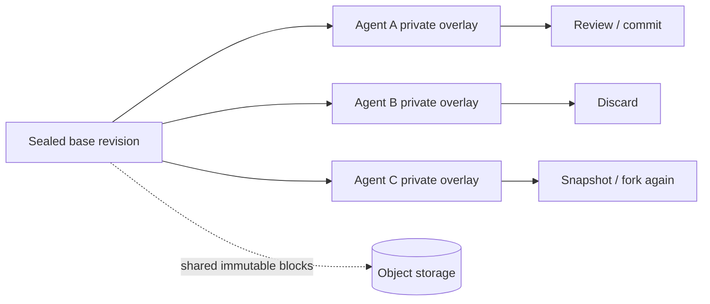
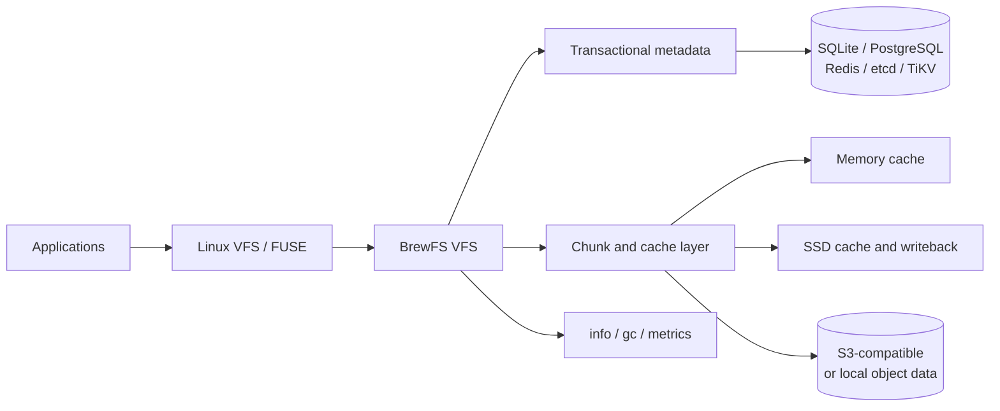

<div align="center">
  
  <p><strong>A Rust distributed filesystem for object storage, POSIX workloads, and isolated agent workspaces.</strong></p>

  <p>
    <a href="https://github.com/brewfs/brewfs/actions/workflows/ci.yml"></a>
    <a href="https://github.com/brewfs/brewfs/releases"></a>
    <a href="https://www.rust-lang.org/"></a>
    <a href="LICENSE"></a>
  </p>
  <p>
    <a href="#quick-start">Quick Start</a> ·
    <a href="#agent-workspaces">Agent Workspaces</a> ·
    <a href="#architecture">Architecture</a> ·
    <a href="#performance">Performance</a> ·
    <a href="doc/README.md">Documentation</a> ·
    <a href="README_CN.md">中文</a>
  </p>
</div>

BrewFS exposes a Linux filesystem through FUSE while keeping metadata and file
data independently deployable. Metadata can live in Redis, TiKV, etcd,
PostgreSQL, or SQLite; immutable data blocks can live in S3-compatible object
storage or on a local filesystem.

The project is built as one Rust data path from FUSE and VFS through caching,
writeback, metadata transactions, and object storage. BrewFS is independent:
RustFS, MinIO, AWS S3, and Ceph RGW are supported S3-compatible backends, not
parts of BrewFS itself.

> [!IMPORTANT]
> BrewFS is under active development. The regular `flat-v1` volume is the
> default. Agent-oriented `workspace-v1` volumes are implemented behind the
> optional `workspace-overlay` Cargo feature while their operational tooling
> continues to mature.

## Why BrewFS

- **Object-storage-native data path.** Files are split into 64 MiB chunks and
  4 MiB blocks, with immutable objects below a transactional namespace.
- **Tiered read and write acceleration.** Linux page cache, BrewFS memory cache,
  SSD cache, read-ahead, writeback staging, and large-write coalescing work
  together instead of treating object storage as a block device.
- **Isolated agent sandboxes.** Workspace Overlay lets agents share one sealed
  base while keeping namespace, inode, xattr, ACL, and extent changes private.
- **Deployable in stages.** Start with SQLite and local data, move metadata to a
  distributed backend, then attach any supported S3-compatible store.
- **Correctness is measured.** The repository carries Rust tests, xfstests,
  pjdfstest, LTP, stress-ng, fio, fuzzing, and repeatable Docker Compose runners.
- **Read amplification is controlled.** The current read path checks memory and
  Linux page-cache hits before local disk cache access, serves persistent slices
  by range, and tracks buffered FUSE fragments per handle. A complete block is
  promoted only after reuse is observed, while high-concurrency lookahead stays
  private to avoid polluting the shared cache.
- **Observable operations.** Runtime statistics, `info`, `gc`, writeback
  accounting, and profiling hooks make performance and recovery behavior
  inspectable.

## Quick Start

### Install a complete single-node stack

On Linux, the installer provisions BrewFS, Redis, RustFS, systemd services, and
a FUSE mount at `/mnt/brewfs`:

```bash
curl -fsSL https://raw.githubusercontent.com/brewfs/brewfs/main/scripts/install_brewfs_single_node.sh \
  | sudo bash -s -- install
```

Verify the services and mount:

```bash
sudo systemctl status brewfs.service brewfs-redis.service brewfs-rustfs.service
mountpoint /mnt/brewfs
sudo /usr/local/bin/brewfs info /mnt/brewfs
```

The same installer supports `status`, `restart`, `upgrade`, and
`uninstall`. Set `MOUNT_POINT`, `BREWFS_VERSION`, or
`BREWFS_TUNING_PROFILE` to customize the installation. See the
[binary deployment guide](doc/operations/binary-deployment.md) before using
the stack for persistent data.

### Build a local development mount

Requirements: Linux, FUSE 3, and Rust 1.85 or newer.

```bash
cargo build -p brewfs --release

mkdir -p /tmp/brewfs-mnt /tmp/brewfs-data
target/release/brewfs mount /tmp/brewfs-mnt \
  --data-backend local-fs \
  --data-dir /tmp/brewfs-data \
  --meta-backend sqlx \
  --meta-url 'sqlite:///tmp/brewfs-meta.db?mode=rwc'
```

In another terminal:

```bash
touch /tmp/brewfs-mnt/hello
target/release/brewfs info /tmp/brewfs-mnt
fusermount3 -u /tmp/brewfs-mnt
```

For S3 credentials, cache sizing, writeback modes, FUSE workers, and YAML
configuration, use the [configuration reference](doc/operations/configuration.md).

## Agent Workspaces

AI coding agents often begin from the same checkout but need private,
short-lived mutations. Copying an entire filesystem per agent wastes time and
object capacity; sharing one writable mount weakens isolation.

BrewFS Workspace Overlay provides a filesystem-native alternative:

1. A **sealed base** holds the shared namespace and immutable object blocks.
2. Each agent gets one **private writable overlay**.
3. Forking creates metadata and a new writable head; it does not copy clean
   object data.
4. `diff`, snapshot, fast-forward `commit`, and lease-aware `discard`
   make changes explicit.
5. Backend-time leases and generation fencing prevent a stale mount from
   writing after ownership changes.


```mermaid
flowchart LR
    Base[Sealed base revision] --> A[Agent A private overlay]
    Base --> B[Agent B private overlay]
    Base --> C[Agent C private overlay]
    A --> Commit[Review / commit]
    B --> Discard[Discard]
    C --> Snapshot[Snapshot / fork again]
    Base -. shared immutable blocks .-> Objects[(Object storage)]
```

The feature is opt-in and does not alter regular flat volumes:

```bash
cargo build -p brewfs --release --features workspace-overlay
target/release/brewfs workspace --help
```

The CLI exposes `init-volume`, `create`, `snapshot`, `fork`, `list`,
`inspect`, `diff`, `commit`, and `discard`. Redis and TiKV are the
distributed catalog backends; SQLite is available for local semantics and
development. Every mounted workspace resolves exactly two layers: one private
writable head and one fixed sealed base.

Current boundaries are intentional: the feature is off by default,
`workspace-v1` never falls back to flat-volume behavior, workspace
`statfs` waits for atomic usage counters, and the WebDAV gateway currently
accepts only `flat-v1`. Read the
[Workspace Overlay architecture](doc/architecture/workspace-overlay.md) before
building an operator or multi-agent service around it.

## Architecture


```mermaid
flowchart LR
    Apps[Applications] --> VFS[Linux VFS / FUSE]
    VFS --> Brew[BrewFS VFS]
    Brew --> Meta[Transactional metadata]
    Meta --> MetaDB[(SQLite / PostgreSQL<br/>Redis / etcd / TiKV)]
    Brew --> Cache[Chunk and cache layer]
    Cache --> Memory[Memory cache]
    Cache --> SSD[SSD cache and writeback]
    Cache --> Objects[(S3-compatible<br/>or local object data)]
    Brew --> Control[info / gc / metrics]
```

- **FUSE + VFS** implement inode-based filesystem operations, permissions,
  locks, links, sparse files, truncate, and rename.
- **Metadata** stores namespaces, attributes, slices, sessions, and
  transactions independently from object data.
- **Chunk + cache** resolve file extents into immutable blocks and coordinate
  memory caching, persistent caching, ranged slice reads, read-ahead,
  confirmed block promotion, writeback, compaction, and GC.
- **Gateways** can expose flat volumes through S3 or WebDAV without requiring
  each client to mount FUSE.

See the [architecture guide](doc/architecture/arch.md), [read path](doc/architecture/read-path.md),
[write path](doc/architecture/write-path.md), and [consistency model](doc/architecture/consistency.md).

## Performance

The current public baseline is the aligned Aliyun run from **2026-09-22**.
BrewFS and JuiceFS 1.4.1 used the same ECS specification, image, disk class,
region, OSS internal path, fio workload, and aggregate cache budgets. Both ran
buffered `io_uring` with `direct=0`, `iodepth=1`, and 4 MiB fio blocks.
Each side had 4 GiB of memory cache and 8 GiB of SSD cache. All 11 tools passed.

Reads below are measured throughput. Workloads containing writes use
**fully-drained throughput**: actual bytes divided by active I/O time plus the
time required to empty the filesystem writeback queue.

| Workload | BrewFS | JuiceFS 1.4.1 | BrewFS delta |
| --- | ---: | ---: | ---: |
| Large read | 334.42 MiB/s | 328.94 MiB/s | +1.7% |
| Sequential read | 1,814.4 MiB/s | 1,321.6 MiB/s | +37.3% |
| Random read | 2,510.7 MiB/s | 1,773.3 MiB/s | +41.6% |
| Large write, fully drained | 217.55 MiB/s | 208.26 MiB/s | +4.5% |
| Sequential write, fully drained | 320.43 MiB/s | 184.57 MiB/s | +73.6% |
| Random write, fully drained | 328.73 MiB/s | 198.31 MiB/s | +65.8% |
| Mixed random I/O, fully drained total | 475.77 MiB/s | 190.55 MiB/s | +149.7% |

<details>
<summary><strong>Methodology, read-path evidence, and limits</strong></summary>

- Big read uses one warmup plus three measured passes. The mount is recreated
  and local cache-file pages are evicted between measured passes.
- BrewFS used a Linux 6.8.12 kernel carrying the upstream FUSE `io_pages`
  fix, `max_read=4 MiB`, and `BREWFS_FUSE_READ_DIRECT_IO=0`. This keeps the
  Linux page cache instead of using direct I/O to bypass the old 256 KiB split.
- Sequential read recorded a 100% BrewFS block-cache hit rate and zero object
  GETs. Random read recorded 99.9% cache hits and 16 object GETs. FUSE read
  bytes divided by cache requests were about 1 MiB in both workloads; cache
  request counts are not presented as exact FUSE operation counts.
- Write drain was 4/4/2/2 seconds for BrewFS and 4/127/118/91 seconds for
  JuiceFS across large, sequential, random, and mixed writes.
- Throughput is not the whole result. BrewFS random-write and mixed-write p99
  were 463.471 ms and 492.831 ms, versus 92.799 ms and 10.945 ms for JuiceFS.
  Reducing foreground write tail latency is an explicit optimization target.
- JuiceFS 1.4.1 did not support the requested `max-downloads` setting; the
  runner records it as unsupported rather than treating it as active.
- The current `main` read path includes PR #135 and PR #136: page-cache hits
  are checked before disk-cache fallback, persistent-slice reads can avoid
  premature full-block promotion, and buffered FUSE fragments use private
  lookahead before promoting a confirmed full block. These changes reduce
  redundant `pread` and cache-fill work without changing the negotiated FUSE
  request size.
- Mount `.stats` exposes exact `brewfs_fuse_read_ops_total` and
  `brewfs_fuse_read_bytes_total` counters, alongside
  `brewfs_read_page_cache_hits_total`,
  `brewfs_read_block_cache_hits_total`, and
  `brewfs_persistent_slice_read_{ops,bytes}_total`. Use these counters when
  explaining a performance result; cache requests are not FUSE call counts.

Result Vault:

- BrewFS: `run-20260922-130750-c50cef22`
- JuiceFS: `run-20260922-135411-77149372`

</details>

These are single-configuration engineering results, not a universal
performance claim. Reproduction details live in the
[Aliyun performance guide](docker/compose-xfstests/aliyun/README.md) and the
[benchmark guide](doc/testing/bench.md).

## Correctness and Testing

Performance changes are accepted only with correctness and mixed-I/O gates.
The maintained validation baseline includes:

| Suite | Current maintained baseline |
| --- | --- |
| Rust workspace tests | Unit and integration coverage across VFS, caches, metadata, gateways, and workspace overlay |
| xfstests | 708 configured cases passed on SQLite, Redis, etcd, and TiKV profiles |
| pjdfstest | 246 files and 9,134 assertions passed on Redis and TiKV, with no default exclusions |
| LTP filesystem profiles | Passed across all four metadata backends with documented exclusions |
| Stress and performance | stress-ng plus fio read, write, mixed-I/O, latency, cache, and drain accounting |

The word "configured" matters: kernel/FUSE limitations and unsupported
operations remain documented rather than being counted as passes. See the
[filesystem test matrix](doc/testing/fs-test-suite-matrix.md) for artifacts,
exclusions, and known limitations.

Run the fast local gate:

```bash
cargo test -p brewfs

cd docker
bash compose-xfstests/run_redis_xfstests.sh --cases "generic/001"
bash compose-xfstests/run_redis_pjdfstest.sh
```

The [Docker Compose testing guide](doc/testing/docker-compose-test-guide.md)
covers Redis, TiKV, RustFS, xfstests, pjdfstest, LTP, stress-ng, fio, and
performance profiling.

## Roadmap

These are current priorities, not release guarantees:

- **v0.1.3 release:** validate the Quick Start on a clean host, publish the
  current main binaries, and keep the README/performance baseline aligned with
  the merged read-path work.
- **Agent workspace productization:** operator-managed lifecycle, atomic usage
  accounting for `statfs`, simpler workspace mount UX, and gateway support
  without weakening layer isolation or fencing.
- **Predictable write latency:** preserve fully-drained throughput while
  reducing random and mixed-write p99 through better queue fairness,
  backpressure, and foreground/background resource isolation.
- **Multi-client confidence:** broaden concurrent-client, failure-recovery,
  lease-expiry, and rolling-upgrade testing.
- **Read-path portability:** detect kernels with the FUSE `io_pages` fix,
  retain a safe compatibility mode for older kernels, and expose exact
  request-size observability.
- **Ecosystem:** continue hardening S3 and WebDAV gateways, deployment tooling,
  metrics, and workload-specific profiles.

## Documentation

- [Documentation index](doc/README.md)
- [Architecture](doc/architecture/arch.md)
- [Workspace Overlay](doc/architecture/workspace-overlay.md)
- [Configuration](doc/operations/configuration.md)
- [Binary deployment](doc/operations/binary-deployment.md)
- [Observability](doc/operations/observability.md)
- [S3 and WebDAV gateways](doc/protocols/README.md)
- [Benchmark guide](doc/testing/bench.md)

## Contributing

Issues and pull requests are welcome. Keep behavior changes, tests, and
documentation together. Performance changes should include reproducible
artifacts and must not move work invisibly from fio runtime into close, flush,
or background drain.

## License

BrewFS is available under the [MIT License](LICENSE).

## Contact

Questions, deployment discussions, and collaboration inquiries are welcome at
[genedna@gmail.com](mailto:genedna@gmail.com).
