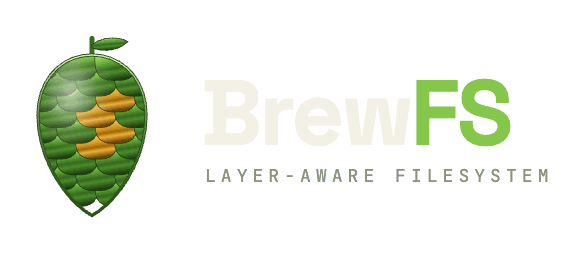
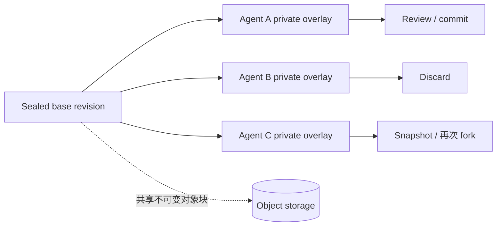
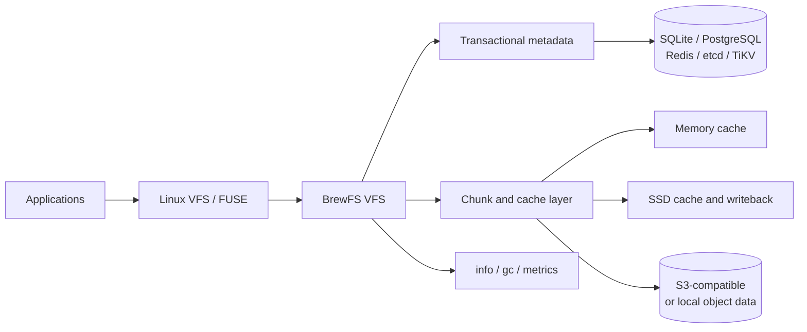

<div align="center">
  
  <p><strong>面向对象存储、POSIX 工作负载与隔离 Agent Workspace 的 Rust 分布式文件系统。</strong></p>

  <p>
    <a href="https://github.com/brewfs/brewfs/actions/workflows/ci.yml"></a>
    <a href="https://github.com/brewfs/brewfs/releases"></a>
    <a href="https://www.rust-lang.org/"></a>
    <a href="LICENSE"></a>
  </p>
  <p>
    <a href="#quick-start">快速开始</a> ·
    <a href="#agent-workspaces">Agent Workspace</a> ·
    <a href="#architecture">架构</a> ·
    <a href="#performance">性能</a> ·
    <a href="doc/README.md">文档</a> ·
    <a href="README.md">English</a>
  </p>
</div>

BrewFS 通过 FUSE 提供 Linux 文件系统接口，同时允许元数据与文件数据独立部署。元数据可以存放在 Redis、TiKV、etcd、PostgreSQL 或 SQLite 中；不可变数据块可以存放在兼容 S3 的对象存储或本地文件系统中。

项目使用 Rust 打通从 FUSE、VFS、缓存、writeback、元数据事务到对象存储的完整数据路径。BrewFS 是独立项目：RustFS、MinIO、AWS S3 与 Ceph RGW 是支持的 S3 兼容后端，不是 BrewFS 本身的一部分。

> [!IMPORTANT]
> BrewFS 仍在积极开发。常规 `flat-v1` volume 是默认模式。面向 Agent 的
> `workspace-v1` 已经实现，但位于可选的 `workspace-overlay` Cargo feature
> 后面，其运维工具仍在继续完善。

## 为什么选择 BrewFS

- **面向对象存储的数据路径。** 文件按 64 MiB chunk 和 4 MiB block 组织，在事务型 namespace 下使用不可变对象。
- **分层读写加速。** Linux page cache、BrewFS 内存缓存、SSD 缓存、预读、writeback staging 和大写聚合共同工作，而不是把对象存储简单模拟成块设备。
- **隔离的 Agent Sandbox。** Workspace Overlay 让多个 Agent 共享同一个 sealed base，同时保持 namespace、inode、xattr、ACL 与 extent 变更相互隔离。
- **可渐进部署。** 可以从 SQLite + 本地数据开始，再切换到分布式元数据后端和任意受支持的 S3 兼容存储。
- **以正确性为门槛。** 仓库内置 Rust tests、xfstests、pjdfstest、LTP、stress-ng、fio、fuzz 与可复现的 Docker Compose runner。
- **控制读放大。** 当前读路径会先检查内存和 Linux page cache，再访问本地磁盘缓存；persistent slice 支持按范围读取，并按句柄跟踪 buffered FUSE fragment。只有观察到重复使用后才会提升完整 block，高并发预读则保持私有，避免污染共享缓存。
- **行为可观测。** 运行时指标、`info`、`gc`、writeback 核算和 profiling 工具让性能与恢复行为可以被检查。

<a id="quick-start"></a>
## 快速开始

### 一键安装完整单机栈

在 Linux 上运行安装器，会部署 BrewFS、Redis、RustFS、systemd 服务，并将 FUSE 文件系统挂载到 `/mnt/brewfs`：

```bash
curl -fsSL https://raw.githubusercontent.com/brewfs/brewfs/main/scripts/install_brewfs_single_node.sh \
  | sudo bash -s -- install
```

检查服务和挂载：

```bash
sudo systemctl status brewfs.service brewfs-redis.service brewfs-rustfs.service
mountpoint /mnt/brewfs
sudo /usr/local/bin/brewfs info /mnt/brewfs
```

同一安装器还支持 `status`、`restart`、`upgrade` 与 `uninstall`。通过
`MOUNT_POINT`、`BREWFS_VERSION` 或 `BREWFS_TUNING_PROFILE` 可以定制安装。将其用于持久数据前，请先阅读[二进制部署文档](doc/operations/binary-deployment.md)。

### 从源码启动本地开发挂载

要求：Linux、FUSE 3，以及 Rust 1.85 或更高版本。

```bash
cargo build -p brewfs --release

mkdir -p /tmp/brewfs-mnt /tmp/brewfs-data
target/release/brewfs mount /tmp/brewfs-mnt \
  --data-backend local-fs \
  --data-dir /tmp/brewfs-data \
  --meta-backend sqlx \
  --meta-url 'sqlite:///tmp/brewfs-meta.db?mode=rwc'
```

在另一个终端中：

```bash
touch /tmp/brewfs-mnt/hello
target/release/brewfs info /tmp/brewfs-mnt
fusermount3 -u /tmp/brewfs-mnt
```

S3 凭据、缓存容量、writeback 模式、FUSE worker 和 YAML 配置请参考[配置说明](doc/operations/configuration.md)。

<a id="agent-workspaces"></a>
## 面向 Agent Sandbox 的 Overlay Workspace

AI 编码 Agent 经常从相同代码基线开始，但需要私有、短生命周期的修改。为每个 Agent 完整复制一套文件系统会浪费时间和对象容量；让所有 Agent 共用一个可写挂载又会削弱隔离。

BrewFS Workspace Overlay 提供文件系统原生的处理方式：

1. **Sealed base** 保存共享 namespace 与不可变对象块。
2. 每个 Agent 获得一个 **private writable overlay**。
3. Fork 只创建元数据和新的 writable head，不复制未修改的对象数据。
4. `diff`、snapshot、fast-forward `commit` 与 lease-aware `discard` 让变更的去向显式可控。
5. 基于元数据后端时间的 lease 与 generation fencing 会阻止已经失去所有权的旧挂载继续写入。



该能力默认关闭，不会改变普通 flat volume：

```bash
cargo build -p brewfs --release --features workspace-overlay
target/release/brewfs workspace --help
```

CLI 已提供 `init-volume`、`create`、`snapshot`、`fork`、`list`、
`inspect`、`diff`、`commit` 与 `discard`。Redis 和 TiKV 是分布式
catalog 后端；SQLite 用于本地语义验证与开发。每个已挂载 workspace 始终只解析两层：一个私有 writable head 和一个固定 sealed base。

当前边界是有意保留的：feature 默认关闭；`workspace-v1` 发生错误时绝不回退到 flat-volume 语义；workspace `statfs` 要等待原子 usage counter；WebDAV gateway 目前只接受 `flat-v1`。构建 operator 或多 Agent 服务前，请先阅读 [Workspace Overlay 架构文档](doc/architecture/workspace-overlay.md)。

<a id="architecture"></a>
## 架构



- **FUSE + VFS** 实现 inode 文件系统操作、权限、锁、链接、稀疏文件、truncate 和 rename。
- **元数据层** 独立于对象数据保存 namespace、属性、slice、session 与事务。
- **Chunk + cache 层** 将文件 extent 解析为不可变 block，协调内存缓存、持久缓存、range slice read、预读、确认后的 block promotion、writeback、compaction 与 GC。
- **Gateway** 可以在客户端不挂载 FUSE 的情况下，通过 S3 或 WebDAV 暴露 flat volume。

深入资料见[架构说明](doc/architecture/arch.md)、[读路径](doc/architecture/read-path.md)、[写路径](doc/architecture/write-path.md)与[一致性模型](doc/architecture/consistency.md)。

<a id="performance"></a>
## 性能

当前公开基线是 **2026-09-22** 的阿里云对齐测试。BrewFS 与 JuiceFS 1.4.1 使用相同 ECS 规格、镜像、磁盘等级、地域、OSS 内网路径、fio workload 和总缓存预算。两边均使用 buffered `io_uring`、`direct=0`、`iodepth=1` 与 4 MiB fio block；各自配置 4 GiB 内存缓存和 8 GiB SSD 缓存。双方 11 项测试全部通过。

读项目使用 measured 吞吐；包含写入的项目使用 **fully-drained 吞吐**，即实际字节数除以 active I/O 时间与文件系统 writeback 队列排空时间之和。

| 负载 | BrewFS | JuiceFS 1.4.1 | BrewFS 相对值 |
| --- | ---: | ---: | ---: |
| 大文件读 | 334.42 MiB/s | 328.94 MiB/s | +1.7% |
| 顺序读 | 1,814.4 MiB/s | 1,321.6 MiB/s | +37.3% |
| 随机读 | 2,510.7 MiB/s | 1,773.3 MiB/s | +41.6% |
| 大文件写，fully drained | 217.55 MiB/s | 208.26 MiB/s | +4.5% |
| 顺序写，fully drained | 320.43 MiB/s | 184.57 MiB/s | +73.6% |
| 随机写，fully drained | 328.73 MiB/s | 198.31 MiB/s | +65.8% |
| 混合随机 I/O，fully drained total | 475.77 MiB/s | 190.55 MiB/s | +149.7% |

<details>
<summary><strong>测试方法、读路径证据与结论边界</strong></summary>

- bigread 执行 1 次 warmup + 3 次 measured；每次 measured 之间重新挂载，并驱逐本地 cache-file 的页面缓存。
- BrewFS 使用带上游 FUSE `io_pages` 修复的 Linux 6.8.12 内核、`max_read=4 MiB` 和 `BREWFS_FUSE_READ_DIRECT_IO=0`。它保留 Linux page cache，而不是用 direct I/O 绕过旧内核的 256 KiB 拆分。
- 顺序读的 BrewFS block-cache 命中率为 100%，对象 GET 为 0；随机读命中率为 99.9%，对象 GET 为 16。两项 workload 的 FUSE read bytes 除以 cache request 均约为 1 MiB；cache request 数不被当作精确 FUSE 调用次数。
- 大文件、顺序、随机和混合写的排空时间，BrewFS 分别为 4/4/2/2 秒，JuiceFS 分别为 4/127/118/91 秒。
- 吞吐不是全部结论。BrewFS 的随机写和混合写 p99 分别为 463.471 ms 和 492.831 ms，JuiceFS 为 92.799 ms 和 10.945 ms。降低前台写长尾是明确的优化目标。
- JuiceFS 1.4.1 不支持请求的 `max-downloads` 配置；runner 将其记录为 unsupported，而不是假定它已经生效。
- 当前 `main` 已包含 PR #135 与 PR #136 的读路径改进：先命中 page cache 再回退到磁盘缓存；persistent slice 支持避免过早提升完整 block；buffered FUSE fragment 会先使用私有预读，确认完整 block 被复用后才提升到共享缓存。这些改动减少了重复 `pread` 和缓存填充开销，但不会修改协商出的 FUSE 请求大小。
- 挂载点 `.stats` 会暴露精确的 `brewfs_fuse_read_ops_total`、`brewfs_fuse_read_bytes_total`，以及 `brewfs_read_page_cache_hits_total`、`brewfs_read_block_cache_hits_total` 和 `brewfs_persistent_slice_read_{ops,bytes}_total`。分析性能时应使用这些计数；cache request 数不能直接当成 FUSE 调用次数。

Result Vault：

- BrewFS：`run-20260922-130750-c50cef22`
- JuiceFS：`run-20260922-135411-77149372`

</details>

这是一组单一云端配置下的工程结果，不是所有部署场景中的普遍性能承诺。复现细节见[阿里云性能测试指南](docker/compose-xfstests/aliyun/README.md)与[基准测试指南](doc/testing/bench.md)。

## 正确性与测试

性能改动只有在通过正确性与 mixed-I/O 门禁后才会被接受。当前维护的验证基线包括：

| 测试套件 | 当前维护基线 |
| --- | --- |
| Rust workspace tests | 覆盖 VFS、缓存、元数据、gateway 与 workspace overlay 的单元和集成测试 |
| xfstests | SQLite、Redis、etcd 与 TiKV profile 均通过 708 个 configured cases |
| pjdfstest | Redis 与 TiKV 均通过 246 个文件、9,134 条 assertion，无默认排除 |
| LTP filesystem profiles | 四种元数据后端均通过，并保留有证据的排除项 |
| Stress 与性能 | stress-ng，以及 fio 读、写、混合 I/O、延迟、缓存和排空核算 |

这里的 “configured” 很重要：内核/FUSE 限制与尚未实现的操作会被记录为 exclusion，而不是被统计为通过。测试 artifact、排除项和已知限制见[文件系统测试矩阵](doc/testing/fs-test-suite-matrix.md)。

运行快速本地门禁：

```bash
cargo test -p brewfs

cd docker
bash compose-xfstests/run_redis_xfstests.sh --cases "generic/001"
bash compose-xfstests/run_redis_pjdfstest.sh
```

[Docker Compose 测试指南](doc/testing/docker-compose-test-guide.md)覆盖 Redis、TiKV、RustFS、xfstests、pjdfstest、LTP、stress-ng、fio 与性能 profiling。

<a id="roadmap"></a>
## 路线图

以下是当前优先级，不是版本承诺：

- **v0.1.3 小版本：** 在干净主机上验证 Quick Start，发布当前 main 的二进制，并让 README/性能基线与已经合入的读路径改动保持一致。
- **Agent Workspace 产品化：** operator 管理的生命周期、支持 `statfs` 的原子 usage accounting、更简单的 workspace mount UX，以及不削弱 layer 隔离和 fencing 的 gateway 支持。
- **可预测的写延迟：** 保持 fully-drained 吞吐优势，同时通过队列公平性、backpressure 和前后台资源隔离降低随机写与混合写 p99。
- **多客户端信心：** 扩展并发客户端、故障恢复、lease 过期与滚动升级测试。
- **读路径可移植性：** 检测包含 FUSE `io_pages` 修复的内核，为旧内核保留安全兼容模式，并提供精确的请求大小观测。
- **生态能力：** 持续完善 S3/WebDAV gateway、部署工具、指标和面向不同 workload 的调优 profile。

## 文档

- [文档索引](doc/README.md)
- [架构说明](doc/architecture/arch.md)
- [Workspace Overlay](doc/architecture/workspace-overlay.md)
- [配置说明](doc/operations/configuration.md)
- [二进制部署](doc/operations/binary-deployment.md)
- [可观测性](doc/operations/observability.md)
- [S3 与 WebDAV Gateway](doc/protocols/README.md)
- [基准测试指南](doc/testing/bench.md)

## 参与贡献

欢迎提交 Issue 与 PR。行为变更、测试与文档应尽量一起提交。性能改动需要提供可复现 artifact，且不能把工作从 fio runtime 隐蔽地转移到 close、flush 或后台 drain。

## 许可证

BrewFS 使用 [MIT License](LICENSE)。

## 联系方式

部署讨论、问题反馈与合作请联系 [genedna@gmail.com](mailto:genedna@gmail.com)。
