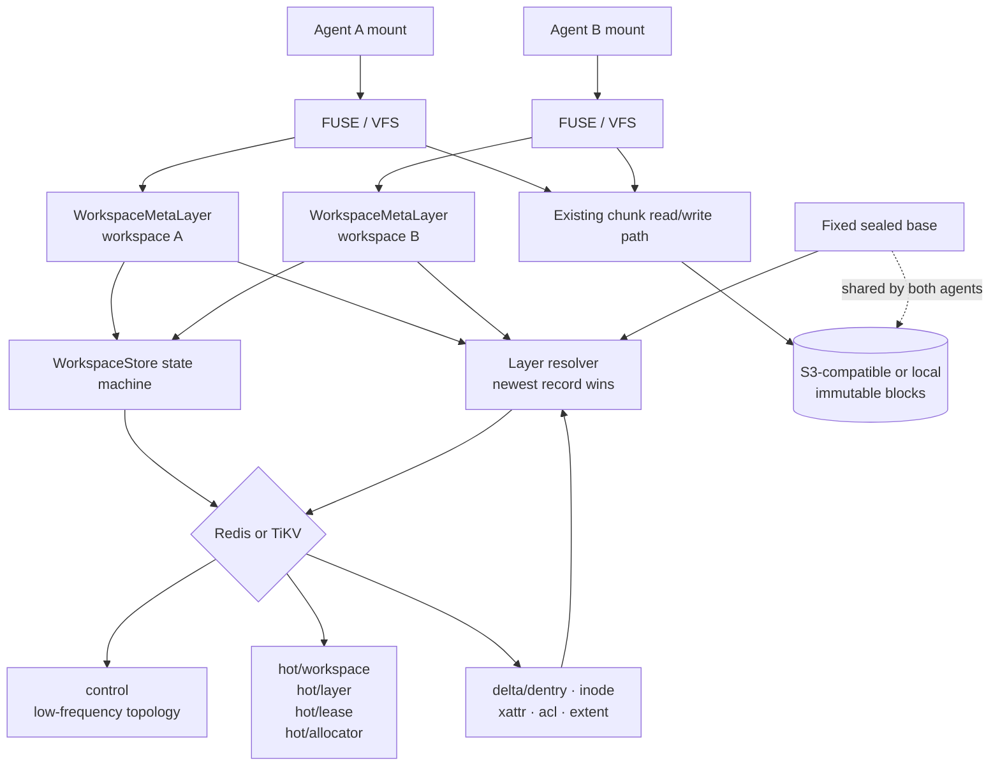
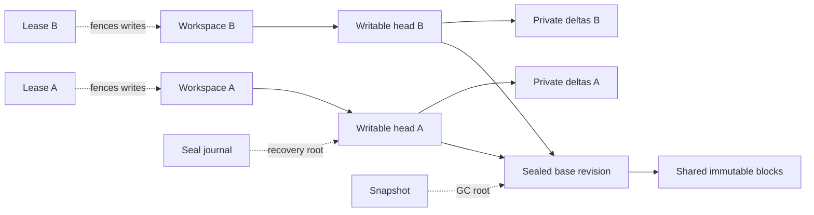
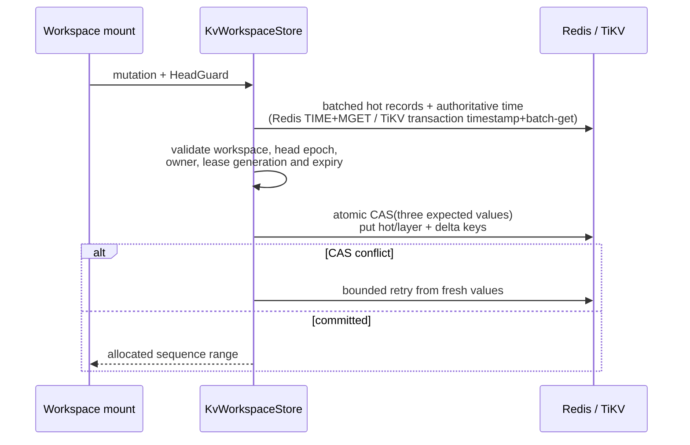

# Workspace Overlay Architecture

- Status: implemented, maintained with `src/workspace_overlay/`
- Cargo feature: `workspace-overlay` (off by default)
- Volume format: `workspace-v1`
- Production metadata backends: Redis and TiKV

This document is the maintained architecture reference for BrewFS agent
workspaces. The detailed API, state-machine fields, and implementation checklist
remain in the
[workspace overlay implementation spec](../superpowers/specs/2026-08-23-brewfs-workspace-overlay-implementation-spec.md).
Changes to persisted records, transaction boundaries, fencing, layer reachability,
or mount integration must update this document in the same pull request.

## Goals and boundaries

Workspace Overlay lets multiple agents share immutable base files and object
blocks while keeping each agent's namespace, inode attributes, and data extents
private. Forking creates metadata records and a new writable head; it does not
copy the sealed base or clean object data.

The feature is deliberately isolated from existing BrewFS volumes:

- flat volumes continue through the existing `MetaStore -> MetaClient -> VFS` path;
- workspace volumes use `WorkspaceStore -> WorkspaceMetaLayer -> VFS`;
- the default build does not compile `src/workspace_overlay/`;
- object keys and the existing `SliceDesc` representation are unchanged;
- a workspace error never falls back to flat-volume semantics.

## Component architecture

Every active view contains exactly two layers: one private writable overlay and
one flat sealed base. The base has no parent and remains fixed until an explicit
seal publishes a replacement base. Point reads batch the two exact keys into one
Redis `MGET` or TiKV batch-get; they never scan metadata. Whiteouts in the upper
stop fallback to the base. Extents are clipped and combined into a read plan
before the existing chunk reader fetches object blocks.

`statfs` does not enumerate inode deltas to synthesize effective usage. Such a
scan is O(N), needs to block workspace mutations for a consistent view, and is
unbounded on the FUSE hot path. Until Redis, TiKV, and SQLite persist usage
counters and update them atomically with each workspace mutation, the workspace
metadata layer returns an explicit `NotSupported` error instead of reporting
zero usage or an inconsistent snapshot.

## Persisted graph

Workspace heads, snapshots, active leases, and incomplete seal journals are GC
roots. A layer or object slice may be deleted only after it is unreachable from
all roots and the configured lease grace period has elapsed.

The active graph invariant is `writable(depth=2) -> sealed(depth=1) -> null`.
Sealed ancestry is never exposed to the FUSE data path.

## Transaction architecture

### Hot data path

Ordinary namespace, inode, xattr, ACL, and extent mutations do not read or CAS
the global `control` record. They atomically check exactly three entity records
and update the current layer plus delta keys:

The writable layer owns its `next_sequence`, so writers in the same workspace
serialize correctly while sibling workspaces do not contend. Lease renewal CASes
only `hot/lease/<lease-id>`. Each ID allocator CASes only its own
`hot/allocator/<name>` record.

Named dentry, inode, xattr, and ACL resolution uses exact batched reads. Prefix
enumeration is reserved for `readdir`, layer materialization, and GC. Redis keeps
a transactionally maintained lexicographic key index so those operations read
only the requested key range; `SCAN MATCH` is used once only to migrate an older
catalog that lacks the index marker.

### Low-frequency topology path

Seal, fork, snapshot, commit, compaction, and GC retain a versioned `control`
document so graph changes remain all-or-reject. Before committing, the store
hydrates and exact-value-checks the hot records used by the transition. The same
backend transaction updates `control`, changed hot mirrors, journals, and any
required delta keys. A concurrent writer or heartbeat therefore makes a stale
topology transaction retry instead of silently committing from an old view.

Redis implements multi-key CAS with a binary-safe Lua script. All workspace keys
use one fixed cluster hash tag. TiKV uses pessimistic transactions and
`get_for_update` for the checked entity keys.

## Authoritative lease time

Lease expiry must be based on metadata-backend time, never mount-host wall time:

- Redis uses `TIME`;
- TiKV reuses the transaction start timestamp and converts its PD TSO physical
  millisecond component to nanoseconds with checked arithmetic;
- SQLite is a local semantic and fault-injection backend and uses its local
  transaction clock.

Every mutation also checks workspace ID, head layer ID, head epoch, lease ID,
holder generation, writable state, and expiry. A stale mount is fenced before
any delta or sequence update is committed.

## State transitions

Writable heads follow `Writable -> Sealing`; abort is permitted only before
hashing and restores the old writable view. A successful seal materializes the
fixed base plus the writable delta into a new flat sealed base, creates one empty
writable overlay, and atomically switches the workspace and active lease to that
pair. Immutable object blocks are reused rather than copied. The durable journal
makes recovery idempotent across crashes, and mount recovery flattens a transient
post-switch chain before admitting a writer.

Fast-forward commit is deliberately restricted: the source revision and target
fork base must still match, the target head must be empty, and the target must
have no active writable lease. Conflicts preserve the child workspace for
inspection or retry.

## Code map

- `src/workspace_overlay/meta_layer.rs`: POSIX-facing workspace metadata layer.
- `src/workspace_overlay/resolver.rs`: layered namespace and extent resolution.
- `src/workspace_overlay/catalog.rs`: backend-neutral storage contract.
- `src/workspace_overlay/stores/kv_store.rs`: shared Redis/TiKV state machine and
  hot-record transaction boundaries.
- `src/workspace_overlay/stores/redis.rs`: Redis key scoping, Lua CAS, server time.
- `src/workspace_overlay/stores/tikv.rs`: TiKV transactions, scans, and PD TSO.
- `src/workspace_overlay/lifecycle.rs`: seal, fork, snapshot, commit, recovery.
- `src/workspace_overlay/gc.rs` and `compaction.rs`: reachability and flattening.
- `src/workspace_overlay/cache_scope.rs`: workspace-aware cache identities.

## Required maintenance and verification

Any architecture change must preserve and test these invariants:

1. sibling workspaces share sealed bases but never observe each other's deltas;
2. hot mutations never CAS `control`;
3. same-head sequence allocation is gap-safe under backend CAS retries;
4. heartbeat and allocators remain entity-local;
5. stale epochs and lease generations cannot partially write;
6. active leases and incomplete journals prevent premature GC;
7. default flat-volume behavior and serialized metadata remain unchanged;
8. Redis and TiKV both pass the distributed two-store concurrency contract.
9. every mounted workspace resolves exactly two layers;
10. named point reads issue no prefix scans, regardless of backend key count.

The feature test suite, resolver oracle tests, real Redis/TiKV backend contracts,
dual-mount isolation tests, pjdfstest, and xfstests gates are the acceptance
evidence for this subsystem.
