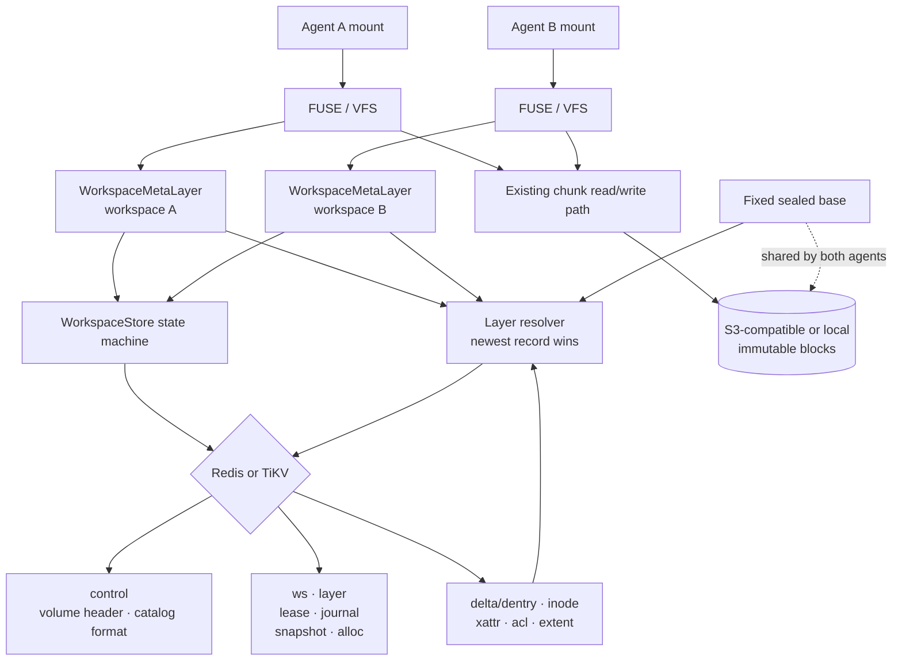
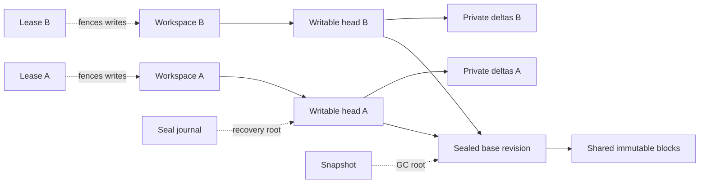
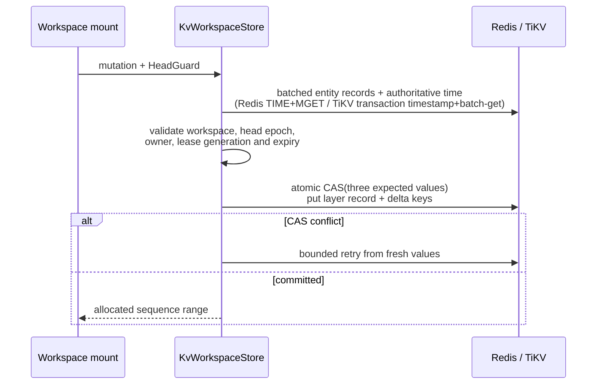

# Workspace Overlay Architecture

- Status: implemented, maintained with `src/workspace_overlay/`
- Cargo feature: `workspace-overlay` (off by default)
- Volume format: `workspace-v1`
- Catalog format: 2 (entity-key layout; `control` keeps only the volume header)
- Production metadata backends: Redis and TiKV

This document is the maintained architecture reference for BrewFS agent
workspaces. The detailed API, state-machine fields, and implementation checklist
remain in the
[workspace overlay implementation spec](../superpowers/specs/2026-08-23-brewfs-workspace-overlay-implementation-spec.md).
Changes to persisted records, transaction boundaries, fencing, layer reachability,
or mount integration must update this document in the same pull request.

## Goals and boundaries

Workspace Overlay lets multiple agents share immutable base files and object
blocks while keeping each agent's namespace, inode attributes, and data extents
private. Forking creates metadata records and a new writable head; it does not
copy the sealed base or clean object data.

The feature is deliberately isolated from existing BrewFS volumes:

- flat volumes continue through the existing `MetaStore -> MetaClient -> VFS` path;
- workspace volumes use `WorkspaceStore -> WorkspaceMetaLayer -> VFS`;
- the default build does not compile `src/workspace_overlay/`;
- object keys and the existing `SliceDesc` representation are unchanged;
- a workspace error never falls back to flat-volume semantics.

## Component architecture


```mermaid
flowchart TB
    AgentA[Agent A mount] --> FuseA[FUSE / VFS]
    AgentB[Agent B mount] --> FuseB[FUSE / VFS]

    FuseA --> MetaA[WorkspaceMetaLayer<br/>workspace A]
    FuseB --> MetaB[WorkspaceMetaLayer<br/>workspace B]

    MetaA --> Resolver[Layer resolver<br/>newest record wins]
    MetaB --> Resolver
    MetaA --> Catalog[WorkspaceStore state machine]
    MetaB --> Catalog

    Catalog --> KV{Redis or TiKV}
    Resolver --> KV

    KV --> Control[control<br/>volume header · catalog format]
    KV --> Entities[ws · layer<br/>lease · journal<br/>snapshot · alloc]
    KV --> Delta[delta/dentry · inode<br/>xattr · acl · extent]

    FuseA --> Chunk[Existing chunk read/write path]
    FuseB --> Chunk
    Chunk --> Objects[(S3-compatible or local<br/>immutable blocks)]

    Shared[Fixed sealed base] --> Resolver
    Delta --> Resolver
    Shared -. shared by both agents .-> Objects
```

Every active view contains exactly two layers: one private writable overlay and
one flat sealed base. The base has no parent and remains fixed until an explicit
seal publishes a replacement base. Point reads batch the two exact keys into one
Redis `MGET` or TiKV batch-get; they never scan metadata. Whiteouts in the upper
stop fallback to the base. Extents are clipped and combined into a read plan
before the existing chunk reader fetches object blocks.

`statfs` does not enumerate inode deltas to synthesize effective usage. Such a
scan is O(N), needs to block workspace mutations for a consistent view, and is
unbounded on the FUSE hot path. Until Redis, TiKV, and SQLite persist usage
counters and update them atomically with each workspace mutation, the workspace
metadata layer returns an explicit `NotSupported` error instead of reporting
zero usage or an inconsistent snapshot.

## Persisted graph


```mermaid
flowchart LR
    WS1[Workspace A] --> HA[Writable head A]
    WS2[Workspace B] --> HB[Writable head B]
    HA --> Base[Sealed base revision]
    HB --> Base
    LeaseA[Lease A] -. fences writes .-> WS1
    LeaseB[Lease B] -. fences writes .-> WS2
    Snap[Snapshot] -. GC root .-> Base
    Journal[Seal journal] -. recovery root .-> HA

    HA --> DA[Private deltas A]
    HB --> DB[Private deltas B]
    Base --> Blocks[Shared immutable blocks]
```

Workspace heads, snapshots, active leases, and incomplete seal journals are GC
roots. A layer or object slice may be deleted only after it is unreachable from
all roots and the configured lease grace period has elapsed.

The active graph invariant is `writable(depth=2) -> sealed(depth=1) -> null`.
Sealed ancestry is never exposed to the FUSE data path.

## Transaction architecture

### Hot data path

Ordinary namespace, inode, xattr, ACL, and extent mutations do not read or CAS
the global `control` record. They atomically check exactly three entity records
(`ws/<workspace-id>`, `layer/<head-layer-id>`,
`lease/<workspace-id>/<lease-id>`) and update the current layer plus delta
keys:


```mermaid
sequenceDiagram
    participant M as Workspace mount
    participant S as KvWorkspaceStore
    participant K as Redis / TiKV

    M->>S: mutation + HeadGuard
    S->>K: batched entity records + authoritative time<br/>(Redis TIME+MGET / TiKV transaction timestamp+batch-get)
    S->>S: validate workspace, head epoch,<br/>owner, lease generation and expiry
    S->>K: atomic CAS(three expected values)<br/>put layer record + delta keys
    alt CAS conflict
        S->>K: bounded retry from fresh values
    else committed
        S-->>M: allocated sequence range
    end
```

The writable layer owns its `next_sequence`, so writers in the same workspace
serialize correctly while sibling workspaces do not contend. Lease renewal CASes
only `lease/<workspace-id>/<lease-id>`. Each ID allocator CASes only its own
`alloc/<name>` record.

Named dentry, inode, xattr, and ACL resolution uses exact batched reads. Prefix
enumeration is reserved for `readdir`, layer materialization, and GC. Redis keeps
a transactionally maintained lexicographic key index so those operations read
only the requested key range; `SCAN MATCH` is used once only to migrate an older
catalog that lacks the index marker.

### Low-frequency topology path

Seal, fork, snapshot, commit, compaction, GC, and lease acquire/release build a
read-tracked topology transaction. The store reads each entity it needs by exact
key, records the original value of every read, and runs a pure closure that
validates and modifies those entities. The check set equals the read set, the
write set is exactly the entities the closure modified, and one multi-key CAS
commits all checks and writes atomically; an outside observer sees either the
pre-commit or the post-commit state. A closure cannot read an entity it did not
declare, so an undeclared dependency fails at the interface instead of silently
committing from an old view, and retries re-execute the closure on fresh values.

Every topology operation touches only keys of the workspaces it involves. Sibling
workspaces' seals, forks, and GC run in parallel, and heartbeats or hot writes
from unrelated workspaces never intersect a topology transaction's check set.
Conflicting retries use bounded exponential backoff with jitter. There is no
process-global topology gate: concurrent topology transactions serialize through
the backend multi-key CAS, and transactions on different workspaces proceed in
parallel.

The catalog stores one key per entity — `ws/<workspace-id>`,
`layer/<layer-id>`, `lease/<workspace-id>/<lease-id>`,
`journal/<workspace-id>/<journal-id>`, `snapshot/<snapshot-id>`, and
`alloc/<name>` — with entity keys as the sole copy of each record. The
`control` key holds only the volume header and catalog format and is written
only at volume creation and catalog migration. Lease and journal keys are
grouped by workspace prefix so per-workspace listing stays exact.

A single active writable lease per workspace is enforced by
`WorkspaceRecord.active_lease`: acquire CASes the field `None ->
Some(lease_id)`, release and expiry clear it, and acquire also clears a dangling
pointer to an already-invalid lease so no termination path can block remount.

GC deletes a layer in two phases: it CAS-marks the candidate `Deleting` from the
exact value it read, rescans the root set to confirm no new root references the
layer (abandoning the deletion and restoring `Sealed` on a hit), and only then
deletes the delta keys and the layer record. Root-creating operations (fork,
snapshot, lease acquire, seal begin) CAS-check the exact value of the base layer
they reference, including `state == Sealed`. GC also reaps `Released`/`Expired`
leases and `Completed`/`Aborted` journals past their grace period, keeping the
most recent journal per workspace for `inspect`, so catalog size tracks active
entities. Expired-lease reaping lives in lease acquire, the GC cycle, and the
start of seal recovery; the heartbeat task only renews its own lease and stops
on renewal failure, after which writes are fenced.

`initialize_workspace_schema` migrates older catalogs: it detects the previous
document format, writes each entity to its entity key, and CAS-switches `control`
to a header-only document with `catalog_format: 2`. The single-key CAS makes the
migration run once and a crash mid-migration can resume. Mounting refuses an
unmigrated catalog and points at the migration command:

```text
brewfs workspace --meta-backend redis --meta-url <url> migrate
brewfs workspace --meta-backend sqlx --meta-url <url> migrate
brewfs workspace --meta-backend tikv --meta-tikv-pd-endpoints <pd-endpoints> migrate
```

TiKV selects its PD endpoints with `--meta-tikv-pd-endpoints`; `--meta-url` is
used only by the Redis and SQLite backends. The command selects the same
backend, endpoint, and `workspace-namespace` as every other workspace CLI
invocation. Migration is one-way: once `control` carries
`catalog_format: 2`, older binaries that only understand the entity-table
document cannot read the catalog, so the release notes must state that all
readers must be upgraded before `migrate` runs.

Redis implements multi-key CAS with a binary-safe Lua script. All workspace keys
use one fixed cluster hash tag. TiKV uses pessimistic transactions and
`get_for_update` for the checked entity keys.

## Authoritative lease time

Lease expiry must be based on metadata-backend time, never mount-host wall time:

- Redis uses `TIME`;
- TiKV reuses the transaction start timestamp and converts its PD TSO physical
  millisecond component to nanoseconds with checked arithmetic;
- SQLite is a local semantic and fault-injection backend and uses its local
  transaction clock.

Every mutation also checks workspace ID, head layer ID, head epoch, lease ID,
holder generation, writable state, and expiry. A stale mount is fenced before
any delta or sequence update is committed.

## State transitions

Writable heads follow `Writable -> Sealing`; abort is permitted only before
hashing and restores the old writable view. A successful seal materializes the
fixed base plus the writable delta into a new flat sealed base, creates one empty
writable overlay, and atomically switches the workspace and active lease to that
pair. Immutable object blocks are reused rather than copied. The durable journal
makes recovery idempotent across crashes, and mount recovery flattens a transient
post-switch chain before admitting a writer.

Fast-forward commit is deliberately restricted: the source revision and target
fork base must still match, the target head must be empty, and the target must
have no active writable lease. Conflicts preserve the child workspace for
inspection or retry.

## Code map

- `src/workspace_overlay/meta_layer.rs`: POSIX-facing workspace metadata layer.
- `src/workspace_overlay/resolver.rs`: layered namespace and extent resolution.
- `src/workspace_overlay/catalog.rs`: backend-neutral storage contract.
- `src/workspace_overlay/stores/kv_store.rs`: shared Redis/TiKV state machine,
  read-tracked topology transactions, and catalog migration.
- `src/workspace_overlay/stores/redis.rs`: Redis key scoping, Lua CAS, server time.
- `src/workspace_overlay/stores/tikv.rs`: TiKV transactions, scans, and PD TSO.
- `src/workspace_overlay/lifecycle.rs`: seal, fork, snapshot, commit, recovery.
- `src/workspace_overlay/gc.rs` and `compaction.rs`: reachability and flattening.
- `src/workspace_overlay/cache_scope.rs`: workspace-aware cache identities.

## Required maintenance and verification

Any architecture change must preserve and test these invariants:

1. sibling workspaces share sealed bases but never observe each other's deltas;
2. hot mutations never CAS `control`;
3. same-head sequence allocation is gap-safe under backend CAS retries;
4. heartbeat and allocators remain entity-local;
5. stale epochs and lease generations cannot partially write;
6. active leases and incomplete journals prevent premature GC;
7. default flat-volume behavior and serialized metadata remain unchanged;
8. Redis and TiKV both pass the distributed two-store concurrency contract;
9. every mounted workspace resolves exactly two layers;
10. named point reads issue no prefix scans, regardless of backend key count;
11. every topology transaction checks exactly the entities it read and touches no
    other workspace's keys;
12. GC marks a layer `Deleting` and rechecks the root set before deleting its
    delta keys, and root-creating operations check the referenced base layer's
    exact value;
13. `Released`/`Expired` leases and `Completed`/`Aborted` journals past grace
    are reaped, and the heartbeat task never reaps leases;
14. mounting refuses an unmigrated catalog and directs the operator to the
    migration command.

The feature test suite, resolver oracle tests, real Redis/TiKV backend contracts,
dual-mount isolation tests, pjdfstest, and xfstests gates are the acceptance
evidence for this subsystem.
